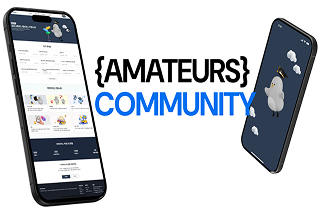
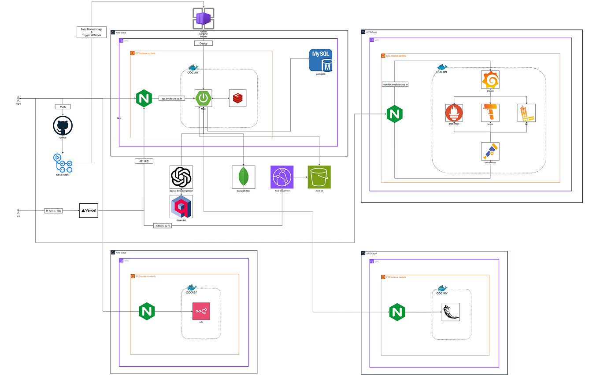
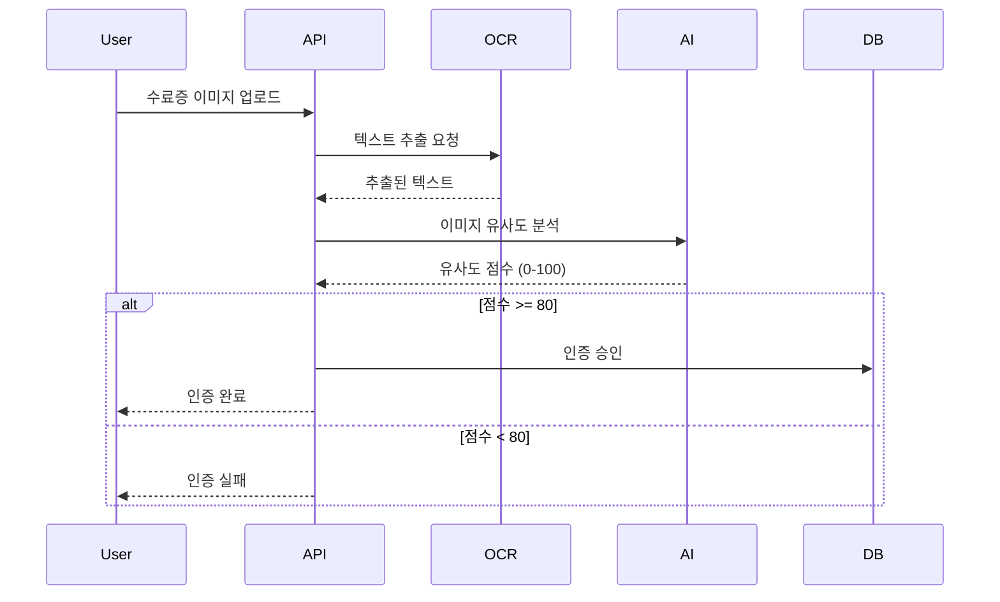
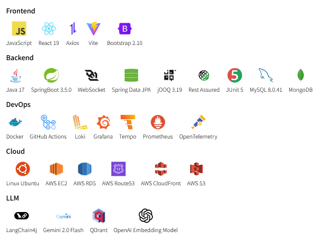

# 🎯 Amateurs

<div align="center">



*프로그래머스 데브코스 수강생들을 위한 커뮤니티 플랫폼*


[](./build/reports/jacoco/test/html/index.html)
[](https://openjdk.org/projects/jdk/17/)
[](https://spring.io/projects/spring-boot)

</div>

---

## 🌟 서비스 소개

**Amateurs**는 프로그래머스 데브코스 수강생들을 위해 만들어진 커뮤니티 플랫폼입니다.

> 💡 **단순한 정보 공유를 넘어, AI 기술로 개인화된 추천글을 제공하고,  
> 실시간 채팅 기능을 제공해 함께 성장하는 개발자 생태계를 구축합니다.**

### ✨ Why Amateurs?

- 🤖 **AI 맞춤 추천**: 개인 관심사 기반 게시글 자동 큐레이션
- ⚡ **실시간 채팅**: WebSocket 채팅 & SSE 알림으로 즉각적인 커뮤니케이션
- 🔐 **스마트 인증**: OCR + AI 이미지 분석을 통한 자동 수강생 인증
- 📊 **데이터 기반**: 사용자 행동 분석을 통한 지속적인 UX 개선

---

## 🏗️ 시스템 아키텍처

<div align="center">



</div>

---

## 🚀 핵심 기능

<table>
<tr>
<td width="50%">

### 🤖 AI 기반 게시글 맞춤 추천
- **벡터 유사도 분석**으로 개인화된 콘텐츠 추천
- **LangChain4j + Gemini** 모델 활용
- **실시간 임베딩** 업데이트로 최신 트렌드 반영

```java
@Service
public class PostRecommendService {
    
    @Autowired
    private EmbeddingStore<TextSegment> embeddingStore;
    
    public List<PostResponseDTO> recommendPosts(Long userId) {
        UserProfile profile = aiProfileService.getProfile(userId);
        List<EmbeddingMatch<TextSegment>> matches = 
            embeddingStore.findRelevant(profile.getEmbedding(), 10);
        return matches.stream()
            .map(this::convertToPostDTO)
            .collect(toList());
    }
}
```

</td>
<td width="50%">

### ⚡ 실시간 커뮤니케이션
- **WebSocket + STOMP** 기반 1:1 채팅
- **SSE** 실시간 알림 시스템
- **MongoDB** 기반 메시지 영구 저장

```java
@MessageMapping("/chat/{roomId}")
public void sendMessage(@DestinationVariable String roomId, 
                       @Payload DirectMessageRequest request) {
    DirectMessageResponse response = 
        directMessageService.saveMessage(request);
    
    messagingTemplate.convertAndSend(
        "/topic/room/" + roomId, response);
    
    // 실시간 알림 전송
    sseService.sendAlarm(response.getReceiverId(), 
                        createAlarm(response));
}
```

</td>
</tr>
<tr>
<td colspan="2">

### 🔐 스마트 수강생 인증 시스템

**OCR + AI 이미지 분석**을 통한 완전 자동화된 인증 프로세스



</td>
</tr>
</table>

---

## 🛠️ 기술 스택



---

## 🧪 테스트 & 품질관리

### 테스트 실행
```bash
# 전체 테스트 실행
./gradlew test

# 커버리지 리포트 생성
./gradlew jacocoTestReport

# 커버리지 검증 (최소 50% 요구)
./gradlew jacocoTestCoverageVerification
```

모든 PR에 대해 최소 2명 이상 승인 필요

---

## 📁 프로젝트 구조

```
src/main/java/kr/co/amateurs/server/
├── 📝 annotation/                          # 커스텀 어노테이션
├── ⚙️ config/                              # 설정 클래스
├── 🎮 controller/                          # REST API 컨트롤러
├── 📊 domain/                              # 도메인 모델
├── 🗄️ repository/                          # 데이터 접근 계층
├── 💼 service/                             # 비즈니스 로직 계층
├── ❌ exception/                           # 예외 처리
├── 🛠️ handler/                             # 핸들러 클래스
├── 🔧 utils/                               # 유틸리티 클래스
└── 🚀 ServerApplication.java               # Spring Boot 메인 애플리케이션
```

---

## 📚 문서

- 📖 **[API 문서](https://api.amateurs.example.com/docs)** - Swagger UI
- 🎯 **[코딩 컨벤션](docs/convention.md)** - 개발 표준 가이드
- 🗄️ **[데이터베이스 가이드](docs/db-guide.md)** - DB 설계 원칙
- ⚡ **[JOOQ 가이드](docs/jooq-guide.md)** - 타입 안전 SQL 작성법

---


## 👥 팀 소개

<div align="center">

### 🏆 Team 으쓱이들

<table>
<tr>
<td align="center">
<a href="https://github.com/klaus9267">
<br />
<sub><b>김민호</b></sub><br />
<sub>🚀 실시간 통신 </sub><br />
<sub>WebSocket, SSE</sub>
</a>
</td>
<td align="center">
<a href="https://github.com/rbxo0128">
<br />
<sub><b>권규태</b></sub><br />
<sub>🏗️ API & Database</sub><br />
<sub>Business Logic, API </sub>
</a>
</td>
<td align="center">
<a href="https://github.com/dldudqlsdlqslek">
<br />
<sub><b>이영빈</b></sub><br />
<sub>🗄️ API & Database</sub><br />
<sub>Business Logic, API</sub>
</a>
</td>
</tr>
<tr>
<td align="center">
<a href="https://github.com/kjyy08">
<br />
<sub><b>김주엽</b></sub><br />
<sub>⚙️ Backend Development</sub><br />
<sub>Infra, JOOQ, DevOps</sub>
</a>
</td>
<td align="center">
<a href="https://github.com/s0ooo0k">
<br />
<sub><b>지현숙</b></sub><br />
<sub>💻 AI Development</sub><br />
<sub>AI, LangChain4j</sub>
</a>
</td>
<td align="center">
<a href="https://github.com/shienka07">
<br />
<sub><b>조경혜</b></sub><br />
<sub>🛠️ Backend Development</sub><br />
<sub>Redis, Security</sub>
</a>
</td>
</tr>
</table>

</div>

---

<div align="center">

### 🎯 프로그래머스 데브코스 생성형 AI 백엔드 1기 최종 프로젝트

**Made with ❤️ by Team 으쓱이들**

⭐ **이 프로젝트가 도움이 되었다면 Star를 눌러주세요!** ⭐

</div>