# 🎯 Amateurs - AI-Powered Community Platform

<div align="center">
  


**차세대 개발자 커뮤니티 플랫폼**  
*프로그래머스 데브코스 수강생들을 위한 AI 기반 맞춤형 학습 생태계*


[](./build/reports/jacoco/test/html/index.html)
[](https://openjdk.org/projects/jdk/17/)
[](https://spring.io/projects/spring-boot)

</div>

---

## 🌟 서비스 소개

**Amateurs**는 프로그래머스 데브코스 수강생들을 위해 탄생한 차세대 커뮤니티 플랫폼입니다. 

> 💡 **단순한 정보 공유를 넘어, AI 기술로 개인화된 추천글을 제공하고,  
> 실시간 소통으로 함께 성장하는 개발자 생태계를 구축합니다.**

### ✨ Why Amateurs?

- 🤖 **AI 맞춤 추천**: 개인 관심사 기반 게시글 자동 큐레이션
- ⚡ **실시간 소통**: WebSocket 채팅 & SSE 알림으로 즉각적인 커뮤니케이션
- 🔐 **스마트 인증**: OCR + AI 이미지 분석을 통한 자동 수강생 인증
- 📊 **데이터 기반**: 사용자 행동 분석을 통한 지속적인 UX 개선

---

## 🏗️ 시스템 아키텍처

<div align="center">


</div>

### 🎯 핵심 설계 원칙

| 원칙 | 구현 방법 | 기대 효과 |
|------|-----------|-----------|
| **확장성** | 마이크로서비스 아키텍처, 이벤트 기반 설계 | 트래픽 증가에 유연한 대응 |
| **성능** | Redis 캐싱, JOOQ 최적화 쿼리 | 빠른 응답 속도 보장 |
| **안정성** | 트랜잭션 분리, 서킷 브레이커 패턴 | 장애 전파 방지 |
| **유지보수성** | Clean Architecture, 디자인 패턴 적용 | 코드 품질 및 생산성 향상 |

---

## 🚀 핵심 기능

<table>
<tr>
<td width="50%">

### 🤖 AI 기반 맞춤 추천
- **벡터 유사도 분석**으로 개인화된 콘텐츠 추천
- **LangChain4j + Gemini** 모델 활용
- **실시간 임베딩** 업데이트로 최신 트렌드 반영

```java
@Service
public class PostRecommendService {
    
    @Autowired
    private EmbeddingStore<TextSegment> embeddingStore;
    
    public List<PostResponseDTO> recommendPosts(Long userId) {
        UserProfile profile = aiProfileService.getProfile(userId);
        List<EmbeddingMatch<TextSegment>> matches = 
            embeddingStore.findRelevant(profile.getEmbedding(), 10);
        return matches.stream()
            .map(this::convertToPostDTO)
            .collect(toList());
    }
}
```

</td>
<td width="50%">

### ⚡ 실시간 커뮤니케이션
- **WebSocket + STOMP** 기반 1:1 채팅
- **SSE** 실시간 알림 시스템
- **MongoDB** 기반 메시지 영구 저장

```java
@MessageMapping("/chat/{roomId}")
public void sendMessage(@DestinationVariable String roomId, 
                       @Payload DirectMessageRequest request) {
    DirectMessageResponse response = 
        directMessageService.saveMessage(request);
    
    messagingTemplate.convertAndSend(
        "/topic/room/" + roomId, response);
    
    // 실시간 알림 전송
    sseService.sendAlarm(response.getReceiverId(), 
                        createAlarm(response));
}
```

</td>
</tr>
<tr>
<td colspan="2">

### 🔐 스마트 수강생 인증 시스템

**OCR + AI 이미지 분석**을 통한 완전 자동화된 인증 프로세스

```mermaid
sequenceDiagram
    participant User
    participant API
    participant OCR
    participant AI
    participant DB
    
    User->>API: 수료증 이미지 업로드
    API->>OCR: 텍스트 추출 요청
    OCR-->>API: 추출된 텍스트
    API->>AI: 이미지 유사도 분석
    AI-->>API: 유사도 점수 (0-100)
    alt 점수 >= 80
        API->>DB: 인증 승인
        API-->>User: 인증 완료
    else 점수 < 80
        API-->>User: 인증 실패
    end
```



</td>
</tr>
</table>

---

## 🛠️ 기술 스택

<div align="center">

### Backend Core


### Database & Cache


### AI & Vector Search


### DevOps & Monitoring


### Cloud & Storage


</div>

---

## 🧪 테스트 & 품질관리

### 테스트 실행
```bash
# 전체 테스트 실행
./gradlew test

# 커버리지 리포트 생성
./gradlew jacocoTestReport

# 커버리지 검증 (최소 50% 요구)
./gradlew jacocoTestCoverageVerification
```

### 코드 품질 메트릭
- **정적 분석**: SonarQube 연동
- **코드 리뷰**: 모든 PR에 대해 최소 2명 승인 필요

---

## 📁 프로젝트 구조

```
src/main/java/kr/co/amateurs/server/
├── 📂 annotation/           # 커스텀 어노테이션
│   ├── alarmtrigger/       # 알람 자동 생성 AOP
│   └── checkpostmetadata/  # 게시글 메타데이터 검증
├── 📂 config/              # 설정 클래스
│   ├── auth/               # 인증/인가 설정
│   ├── jwt/                # JWT 처리
│   └── websocket/          # WebSocket 설정
├── 📂 controller/          # REST API 컨트롤러
├── 📂 domain/              # 도메인 모델
│   ├── dto/                # 데이터 전송 객체
│   ├── entity/             # JPA 엔티티
│   └── enums/              # 열거형 상수
├── 📂 repository/          # 데이터 접근 계층
│   └── [domain]/           # 도메인별 Repository
├── 📂 service/             # 비즈니스 로직
│   ├── ai/                 # AI 관련 서비스
│   ├── alarm/              # 알람 시스템
│   └── [domain]/           # 도메인별 서비스
└── 📂 utils/               # 유틸리티 클래스
```

---

## 🎨 아키텍처 패턴

### 적용된 디자인 패턴

| 패턴 | 적용 위치 | 목적 |
|------|-----------|------|
| **Strategy** | `AlarmCreator`, `CommentQueryStrategy` | 알고리즘 전략 분리 |
| **Factory** | `ReportTargetHandlerFactory` | 객체 생성 책임 분리 |
| **Observer** | Event-Driven Architecture | 느슨한 결합을 통한 확장성 |
| **Template Method** | `BaseEntity`, `BaseService` | 공통 로직 추상화 |
| **Registry** | `AlarmCreatorRegistry` | 타입별 처리기 중앙 관리 |


---

## 📚 문서

- 📖 **[API 문서](https://api.amateurs.example.com/docs)** - Swagger UI
- 🎯 **[코딩 컨벤션](docs/convention.md)** - 개발 표준 가이드
- 🗄️ **[데이터베이스 가이드](docs/db-guide.md)** - DB 설계 원칙
- ⚡ **[JOOQ 가이드](docs/jooq-guide.md)** - 타입 안전 SQL 작성법

---


## 👥 팀 소개

<div align="center">

### 🏆 Team Amateurs - "아마추어처럼 시작해서 프로처럼 완성한다"

<table>
<tr>
<td align="center">
<a href="https://github.com/klaus9267">
<br />
<sub><b>김민호</b></sub><br />
<sub>🚀 실시간 통신 </sub><br />
<sub>WebSocket, SSE</sub>
</a>
</td>
<td align="center">
<a href="https://github.com/rbxo0128">
<br />
<sub><b>권규태</b></sub><br />
<sub>🏗️ API & Database</sub><br />
<sub>Business Logic, API </sub>
</a>
</td>
<td align="center">
<a href="https://github.com/dldudqlsdlqslek">
<br />
<sub><b>이영빈</b></sub><br />
<sub>🗄️ API & Database</sub><br />
<sub>Business Logic, API</sub>
</a>
</td>
</tr>
<tr>
<td align="center">
<a href="https://github.com/kjyy08">
<br />
<sub><b>김주엽</b></sub><br />
<sub>⚙️ Backend Development</sub><br />
<sub>Infra, JOOQ, DevOps</sub>
</a>
</td>
<td align="center">
<a href="https://github.com/s0ooo0k">
<br />
<sub><b>지현숙</b></sub><br />
<sub>💻 AI Development</sub><br />
<sub>AI, LangChain4j</sub>
</a>
</td>
<td align="center">
<a href="https://github.com/shienka07">
<br />
<sub><b>조경혜</b></sub><br />
<sub>🛠️ Backend Development</sub><br />
<sub>Redis, Security</sub>
</a>
</td>
</tr>
</table>

</div>

---

<div align="center">

### 🎯 프로그래머스 데브코스 1기 최종 프로젝트

*"아마추어처럼 시작해서 프로처럼 완성한다"*

**Made with ❤️ by Team Amateurs**

---

⭐ **이 프로젝트가 도움이 되었다면 Star를 눌러주세요!** ⭐

</div>
